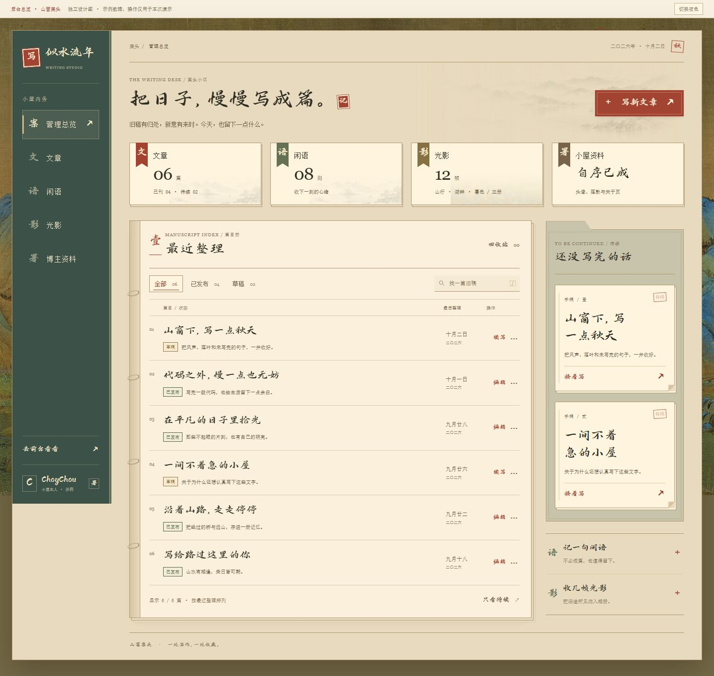
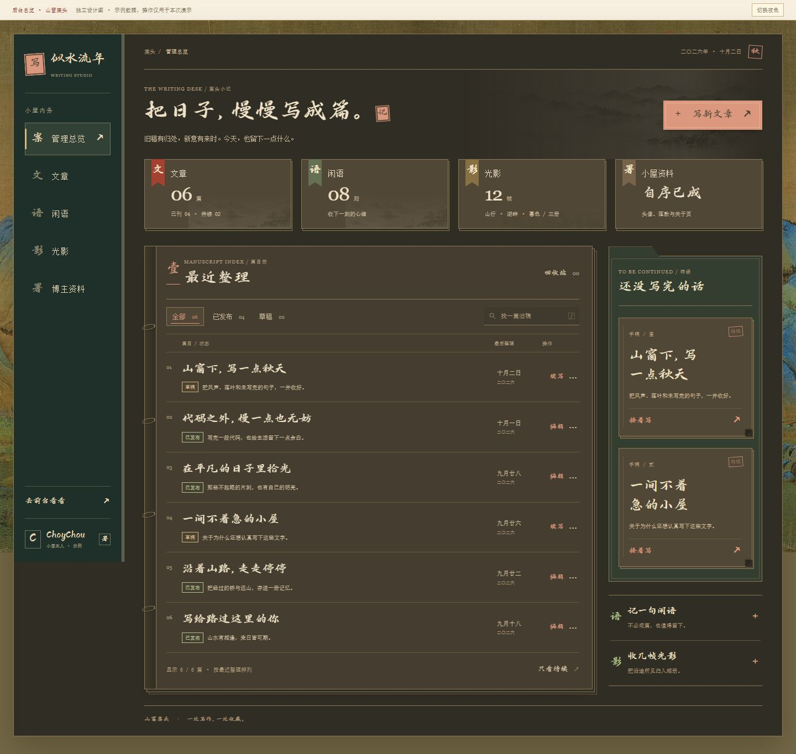
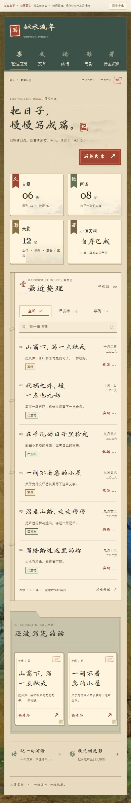

# 后台管理总览设计图：山窗案头

预览地址：http://127.0.0.1:3016/effect-preview/admin-desk-overview-v1.html

本次先设计管理总览，确认后再接入正式后台。HTML、CSS、JavaScript 均位于 `effect-preview/`，未改动生产路由、数据库、登录或权限逻辑。

## 设计方向

沿用现有博客的青绿山水、米色宣纸、手写标题与朱印，以“案头书册”为统一结构。深松绿目录像书脊，文章区像一本篇目册，待续区像一只手稿夹，四个概览入口像书签索引。颜色用于定位，特色集中在稿册的装订边、双层页口与书签结构。

控制装饰数量：整页底纸保持干净，淡山水只用于欢迎区与索引卡下沿；稿册只保留四处装订线环，手稿夹整齐叠页，每张手稿仅一个“待续”印记。标题、状态、摘要、日期和操作各有固定位置，桌面每篇文章收成两行，手机端允许标题自然平衡换行。隐藏 slug 的视觉展示（仍可搜索），不再增加胶带、随笔旁注和重复小印。

- 左侧目录：以深松绿书脊区分导航，保留管理总览、文章、闲语、光影、博主资料。
- 顶部：中文日期、新文章按钮和四枚书签索引，题签下沿切出书签缺口。
- 中间：篇目册通过装订边、页眉序号与双层页口区分内容，显示标题、摘要、发布状态、整理日期和编辑入口。
- 右侧：带页夹凸耳的手稿底板，收纳两张待续手稿，下方是两个简单快捷入口。
- 手机端：目录改为横排，概览卡变成两列，待续手稿移到文章列表下方。

标题使用现有鸿雷行书字体，摘要、输入框和辅助说明使用宋体。保留直接显示的纸面，不增加画轴或页面展开动画。

## 交互演示

| 元素 | 演示行为 |
| --- | --- |
| 概览卡 | 书签轻微伸展、边线响应、下沿淡山水轻移；文章卡返回全部篇目 |
| 待续手稿 | 平时整齐对齐，悬停轻抬，折角和箭头响应；点击打开手稿弹窗 |
| 文章列表 | 朱色页签从页边出现，淡墨随鼠标位置移动；支持按发布状态筛选、搜索标题/摘要/slug |
| 新文章与续写 | 演示编辑篇名、小序、正文；保存后同步列表、计数和待续卡 |
| 回收站 | 演示移入、撤销、恢复；恢复为草稿，与现有后台行为一致 |
| 闲语、光影、资料入口 | 展示功能说明，详情页另出设计图 |
| 日夜切换 | 仅切换本预览的纸面与文字配色 |
| 键盘 | `/` 聚焦搜索，Escape 关闭弹窗或更多菜单，保留可见焦点 |

启用减少动态效果时取消位移与过渡。关闭 JavaScript 时仍可阅读六篇静态示例。

## 数据与正式接入

所有数量、文章与手稿均为示例，顶部已标明。手稿、回收站操作只保存于当前页面内存，刷新后重置；没有向后台 API 写入数据。预览不代表正式 Markdown 编辑器的功能范围。

现有 `/admin` 以文章管理为入口，还没有独立总览。正式实现时需确定总览和文章管理的路由关系，并接入现有文章、闲语、照片、相册及资料数据，沿用已有登录与权限校验。文章编辑仍进入现有编辑器。当前代码没有用于此页面的访问统计来源，因此本稿不展示虚构的流量图表。

## 验证记录

- 在 HTTP 预览中验证了 13 种宽度、日夜两套主题，共 26 组布局，覆盖 360–1440px，无横向溢出。
- 搜索、空状态、筛选、移入回收站、撤销、恢复、新建/编辑/重新打开手稿、弹窗 Escape、快捷搜索、手机弹窗边界与减少动态效果检查通过；未发现页面脚本错误。
- `node --check effect-preview/admin-desk-overview-v1.js`、`tsc --noEmit`、`next build` 通过。
- `vitest run`：69 个测试文件、345 项断言通过，但有 5 个既有 `DailyQuote` 未处理异常（测试环境的 `echo.animate` 不存在），进程退出码为 1，不能称全套测试通过。
- 截图：`screenshots/admin-overview-v1-desktop.jpg`、`screenshots/admin-overview-v1-mobile.jpg`、`screenshots/admin-overview-v1-dark.jpg`。

