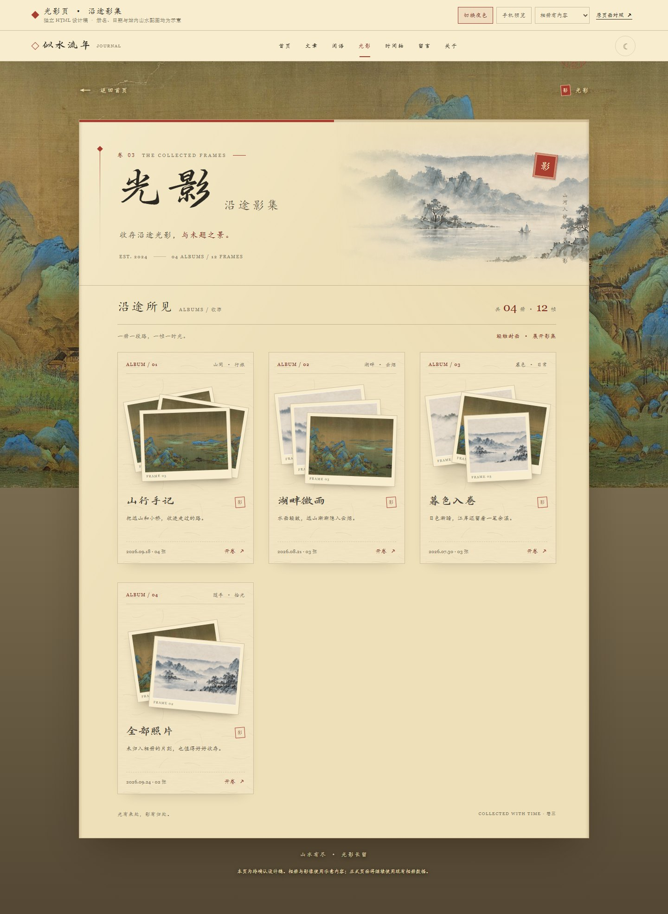

# 光影页 · 沿途影集 HTML 设计稿

日期：2026-10-01。状态：用户已确认，设计已落实到正式 `/album` 页面。

设计文件：[album-collected-light-v1.html](album-collected-light-v1.html)。

## 原有风格与本稿调整

本稿重新查看了当前 `/album`、已确认的 `/moments`，并对照 `app/album/page.tsx`、`app/album.css`、文章和闲语的题头样式及 P05 相册设计规格。保留山水背景、站内书法字体、宣纸、朱印、昼夜主题，以及“相册列表 → 册内照片 → 灯箱”的浏览层级。

| 位置 | 原页面 | 本稿 |
| --- | --- | --- |
| 题头 | 山水上方的简短标题，内容纸页独立 | 与文章、闲语同一套宣纸题头，题签“沿途影集”，卷号 03 |
| 顶部朱线 | 相册纸页没有对应卷序的朱线 | 连续静态朱线占纸宽 3/6，剩余为淡墨线，不分段、不随滚动变化 |
| 相册封面 | 一张封面与说明组成卡片 | 相纸有轻微交叠，三册分别展开、斜列、前景压片；悬停时按各自摆放方向松开，辅以纸面亮斑、朱印着色和底边朱线 |
| 分册边界 | 仅底边分隔，照片和题签容易连成一片 | 每册用完整淡墨纸边、略亮的纸色和内部留白包住照片及题签；册号下方为细线、日期上方为虚线，册间拉开距离；悬停时整册边界转为朱色 |
| 卡片比例 | 加入完整纸边后一度偏长 | 缩短叠片区、收紧册号及文字留白，说明不预留空行；1385px 视口下由 294×456px 调整至 294×347px，390px 下由 326×467px 调整至 326×366px |
| 册内照片 | 现有照片网格及灯箱 | 有序相纸网格，说明和日期放在下方；灯箱完整展示原幅 |
| 未归档照片 | 单独的“全部照片”卡片 | 同名入口作为第 04 册进入相同网格；封面、题签、说明、数量和开卷按钮与其他册完全同构 |
| 手机 | 原有单列封面 | 单列影集保留叠片层次，题头与手机导航随内容容器宽度收拢 |

## 如何审阅

- 点击顶部“切换夜色”与“手机预览”，查看昼夜和窄屏效果。
- 点击各册的封面或“开卷”进入详情；“全部相册”恢复列表浏览位置与焦点。
- 在桌面悬停相册：展开式向两侧舒展、斜列式沿原方向错开、压片式抬起前景照片；第 04 册的两张相纸向两侧松开。纸面亮斑随鼠标位置移动，朱印着色、开卷箭头前移、底边朱线渐现。
- 点击册内照片打开灯箱，使用前后按钮或左右方向键翻看，Escape 关闭；手机可横向滑动原幅。
- 顶部状态选择器可查看整页空相册、册内空相册、首次失败、缓存同步失败、加载和照片失败。
- “原页面对照”打开本轮实拍的原页面桌面截图。

册名、说明、日期与数量仅用于展示版式。配图复用已有 `qianli-bridge.jpg`、`about-ink-banner.png` 和 `guestbook-ink-banner.webp`，没有新增相册数据或网络写入。示例为三册共 10 张，加未归档 2 张，总计 12 张；展示为四个同构的影集入口，未归档照片仍保持原来的归属，正式实现沿用现有真实数据。

## 对照截图

[原页面桌面截图](screenshots/album-before-desktop.jpg) · [本稿桌面截图](screenshots/album-design-desktop.jpg) · [本稿手机截图](screenshots/album-design-mobile.jpg) · [湖畔微雨悬停截图](screenshots/album-hover-desktop.jpg)

## 设计稿验证（正式实现前）

- 通过：1440、1024、768、390、375、360px 的明暗主题，无横向溢出；相册列表分别采用三列、两列、单列。
- 通过：朱线宽度为纸面 50%；桌面内置手机预览真正触发容器断点。
- 通过：开册、未归档入口、返回后恢复滚动和焦点、手机导航、灯箱焦点循环、背景滚动锁定、左右方向键、Escape、手机前后按钮。
- 通过：六种状态在桌面和 360px 下可见且无溢出；重试按钮恢复演示内容；低动态模式关闭动画。
- 通过：四个入口采用相同的相册结构；鼠标悬停时各册相纸变换路径不同、卡片尺寸稳定、亮斑随鼠标移动并在离开时复位。
- 通过：低动态模式保留原来的摆放角度，不播放展开动画；触屏不启用鼠标悬停效果，点击仍可开册。
- 通过：JavaScript 关闭时仍显示题头与四册封面；交互需开启 JavaScript。
- 通过：预览没有页面脚本异常；`npx tsc --noEmit` 和 `npx next build` 均退出 0。
- 未全通过：`npx vitest run` 的 67 个测试文件、335 个用例均通过，但出现 5 个既有 `echo.animate is not a function` 异常，命令退出 1。异常位于 `components/DailyQuote.tsx`，由首页测试触发，本轮未修改这些源文件。

浏览器检查与闸门日志保留在本地 `.design/album-preview-qa.cjs`、`.design/album-qa-results.json`、`.design/album-review-qa.cjs`、`.design/album-hover-qa-results.json`、`.design/album-typecheck.log`、`.design/album-vitest.log`、`.design/album-build.log`；`.design/` 按仓库规则不提交。

## 正式实现与验证

用户确认“正式修改吧”后，已将版式落实到 `app/album/page.tsx`、`app/album.css` 和 `components/AlbumCard.tsx`。数据仍由原有 `AlbumsProvider` 提供，复用原有全局灯箱，没有写入示例相册或改动后台。

- 每册有独立纸框、册号、叠片区和虚线页脚；未归档“全部照片”使用同一组件和网格。
- 封面优先使用相册封面，再取册内照片，去重后最多三张；单张不复制、空册与坏图保持固定相纸位置。三张照片采用展开、斜列、压片三种摆放；两张与单张有对应版式。
- 纸面亮斑按动画帧更新，离开、取消、失焦和卸载时清理；触屏不追踪亮斑，减弱动画模式保留相纸原角度。
- 开册将焦点移至册名，返回恢复原卡片焦点与滚动位置；照片沿用真实说明、日期和灯箱键盘交互。
- 正式页面的 1440、1024、768、390、375、360px 明暗主题均无横向溢出；纸面取站内 `--container-page` 的 960px 标准宽度，顶部朱线占 3/6。桌面卡片约 269×341px，390px 手机约 325×366px。
- 浏览器实测真实数据的开册、未归档入口、悬停、灯箱滚动锁定、Escape、焦点与滚动恢复；隔离的浏览器测试夹具检查三种叠片轨迹、空册、空页、加载、首次失败、缓存同步失败、刷新、坏图与减弱动画。夹具只在本地 `.design/`，没有数据库写入，也没有生产测试入口。页面脚本异常为 0。
- `npx tsc --noEmit`、`npx next build` 均退出 0；生产构建的 `/album` 本地 HTTP 页面也完成上述浏览器检查。
- `npx vitest run`：67 个文件、340 个用例通过，仍有 5 个既有首页 `echo.animate is not a function` 未处理异常，命令退出 1；本次相册页面、样式、灯箱及焦点契约测试均通过，未修改首页动画源文件。

[正式桌面](screenshots/album-formal-desktop.jpg) · [正式手机](screenshots/album-formal-mobile.jpg) · [正式夜色](screenshots/album-formal-dark.jpg)

浏览器原始报告、夹具与闸门日志保留在本地 `.design/album-formal-qa.json`、`.design/album-formal-qa.cjs`、`.design/album-browser-fixture.tsx`、`.design/album-formal-typecheck.log`、`.design/album-formal-vitest-final.log`、`.design/album-formal-build.log`，按仓库规则不提交。
